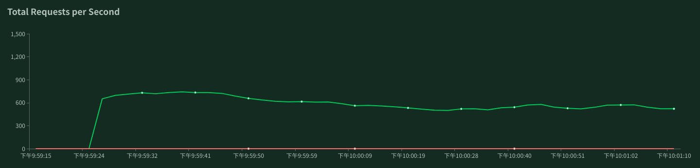
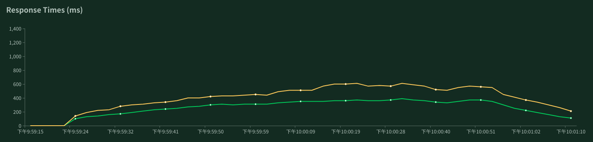

# <center>优惠券发放系统实验报告</center>

# <center>第三组</center>

[toc]

## 1. 贡献表

组内14人贡献均等，此处仅给出组员名单

- **陈德呵**(19214942)
- 陈家兴(19214944)
- 陈小莹(19214946)
- 陈梓烨(19214947)
- 丁诚(19214952)
- 戴斯铭(19214948)
- 范述治(19214953)
- 冯禹豪(19214955)
- 何倩(19214960)
- 江子豪(19214973)
- 蓝嘉璐(19214977)
- 刘义莎(19215005)
- 曾玉莹(19215052)
- 张锐(19215056)

<div STYLE="page-break-after: always;"></div>

## 2. 技术选型

### 2.1 Node.js

 		Node.js是一个基于世界上最快的Javascript引擎—Chrome V8引擎的环境。使用Node.JS搭建的Web服务与传统的Web服务不同，在Java和PHP这类语言中，每个连接都会触发生成一个新线程，每个线程可能需要2MB的配套内存。在一个拥有8GB RAM的系统上，理论上最大的并发连接数量是4,000个用户。随着客户数量的增长，如果希望 应用程序支持更多用户，必须添加更多服务器。除此之外，还有一个潜在技术问题，即用户可能针对每个请求使用不同的服务器，因此，任何共享资源都必须在所有服务器之间共享。鉴于上述原因，整个Web应用程序架构（包括流量、处理器速度和内存速度）中的瓶颈是：服务器能够处理的并发连接的最大数量。Node.js解决这个问题的方法是：更改连接到服务器的方式。每个连接创建一个在Node.js引擎的进程中运行的事件，而不是为每个连接生成一个新的线程，并且不会直接阻塞 I/O 调用，Node.JS具有以下几个特点

- 事件驱动

  ​		所谓事件驱动是指在持续事务管理过程中，进行决策的一种策略，即跟随当前时间点上出现的事件，调动可用资源，执行相关任务，使不断出现的问题得以解决，防止事务堆积。Node.js设计思想中以事件驱动为核心，事件驱动在于异步回调，他提供的大多数api都是基于事件的、异步的风格。而事件驱动的优势在于充分利用系统资源，执行代码无须阻塞等待某种操作完成，有限的资源用于其他任务。事件驱动机制是通过内部单线程高效率地维护事件循环队列来实现的，没有多线程的资源占用和上下文的切换。

- 非阻塞IO

  ​		Node.js遇到I/O事件会创建一个线程去执行，然后主线程继续往下执行，因此，拿profile的动作触发一个I/O事件，马上就会执行拿timeline的动作，两个动作并行执行，假如各需要1S，那么总的时间也就是1S。它们的I/O操作执行完成后，发射一个事件，profile和timeline，事件代理接收后继续往下执行后面的逻辑，这就是Node.js非阻塞I/O的特点。Java、PHP也有办法实现并行请求（子线程），但Node.js通过回调函数（Callback）和异步机制会做得很自然。

- 单线程

  ​		Node.js跟Nginx一样都是单线程为基础的，这里的单线程指主线程为单线程，所有的阻塞的全部放入一个线程池中，然后主线程通过队列的方式跟线程池来协作。我们写js部分不需要关心线程的问题，简单了解就可以了，主要由一堆callback回调构成的，然后主线程在循环过在适当场合调用。

​		针对优惠卷发放这个项目，这个项目主要是属于I/O密集型的应用。而Node.js作为一门脚本语言，开发效率高，适合I/O密集型的应用。同时应用RESTful服务中无状态的特点，可以轻易处理非常大量的连接，本身没有太多的CPU运算，只需要接收HTTP请求，并存取数据即可返回。利用单线程的特点，还可以在多核机器上组成应用集群并进行负载均衡，进一步提高并发效率。

### 2.2 Koa框架

​		Koa和Express都是Node.JS的主流应用开发框架。Express是一个完整的Node.js应用框架。Koa是由Express团队开发的，但是它有不同的关注点。Koa致力于核心中间件功能。Node.js中间件是访问请求对象（req）和响应对象（res）的例程。这些例程在路由处理程序之前被调用，因此它们位于客户端与生成响应的路由逻辑的“中间”。Node.js应用程序可以将中间件例程“链接”到自定义请求/响应管道中。管道可以根据请求和响应进行操作，包括头和主体。Express和Koa都包含中间件，但实现方法却截然不同。核心Koa模块只是中间件内核。而Express包含一个完整的应用程序框架，具有路由和模板等功能。Koa确实有这些功能的选项，但它们是单独的模块。因此，Koa的模块化程度更高；您只需包含所需的模块即可。核心KOA模块只有大约2千行代码，因此，如果您只需要核心请求应答上下文对象，则Koa占用空间非常小。

​		因此，Koa的特点是优雅、简洁、表达力强、自由度高。它与Express相比，它是一个更轻量的Node.js框架，因为它所有功能都通过插件实现，这种插拔式的架构设计模式，是比较符合我们这一次优惠券发放的项目的。同时，Koa采用async/await特性避免了大量的回调，使代码看起来更加优雅简洁。选择Koa框架可以确保本次项目的快速启动以及性能的需求。


​		而针对中间件的架构组织，Koa使用的是洋葱圈模型，请求先是按图中顺序从外部开始向内经过每个中间件模块，然后再逆序依次做出响应。处于外层的中间件必须通过next函数调用内层中间件，当一个中间件调用next()后，会将控制权交给下一个中间件,直到下一个中间件不再执行next()后, 将会沿原路折返,将控制权依次递交给邻接的外层中间件。这样一来，我们可以将功能进行分层解耦，从外至内，依次可以是日志层、异常处理层、数据处理层、业务逻辑层、响应处理层。其中除了业务逻辑层，其他的层都是在不同的Web应用中被复用的，减少了大量的重复造轮子的工作，大幅提高了开发新应用的效率。

### 2.3 JSON Web Token (JWT)

​		Web应用使用B/S架构，HTTP协议一直以来，都是被设计为是无状态的，简单来说，就是服务端在理解一条HTTP请求时，不需要通过上下文来判断，一个HTTP请求即一个完整的服务请求。JWT的基本流程是：客户端使用账号和密码请求登录接口。登录成功后服务器使用密钥生成JWT密文，然后将其返回给客户端。客户端在后续的请求中应携带上该JWT。服务器接收到JWT后验证签名的有效性，对客户端做出相应的响应。这样的话，我们就不需要在服务端存储JWT的信息，JWT是存储在客户端的，只要在加密时将用户id放入JWT载体中，服务器拿到JWT密文后，使用密钥解密后就可以拿到用户信息了，JWT是无状态的，由于加密的密钥存储在服务端，因此在传输过程中即使被第三方获取了JWT密文也无法从中获取任何用于信息，同时它不与任何服务端的机器绑定，只要签名密钥足够安全就能保证JWT的可靠性。所以针对项目的快速开发，减少了工程量，我们在本次项目中使用了JWT的认证机制。

<div STYLE="page-break-after: always;"></div>
## 3. Docker容器

### 3.1 Docker简介

​		Docker属于Linux容器的一种封装，提供简单易用的容器使用接口。Docker将应用程序与该程序的依赖，打包在一个文件里面。运行这个文件，就会生成一个虚拟容器。程序在这个虚拟容器里运行，就好像在真实的物理机上运行一样。
​		总体来说，Docker的接口相当简单，用户可以方便地创建和使用容器，把自己的应用放入容器。容器还可以进行版本管理、复制、分享、修改，就像管理普通的代码一样。相比于传统的虚拟机，Docker有以下几个优点：更高效的利用系统资源，更快速的启动时间，一致的运行环境，持续交付和部署，更轻松的迁移，更轻松的维护和扩展。

### 3.2 Docker环境搭建

#### 3.2.1 服务端镜像制作

* 编写Dockerfile文件 <div align=center>
   
  </div>

* 构建服务器端镜像

  `$ docker build -t=sysu2019semcdfhlz/coupon-pm2 .`

  <div STYLE="page-break-after: always;"></div>

* 运行效果 <div align=center>
   
  </div>

#### 3.2.2 数据库镜像制作

* 编写Dockerfile文件 <div align=center>
   
  </div>

* 构建数据库镜像

  `$ docker build -t=sysu2019semcdfhlz/coupon-db .`

* 运行效果 <div align=center>
   
  </div>

#### 3.2.3 容器编排

* 编写docker-compose.yml文件 <div align=center>
   
  </div>

* 执行docker-compose.yml文件

  `$ docker-compose up`

* 运行效果 <div align=center>
   
    **...**
  </div> <div align=center>
   
  </div>

<div STYLE="page-break-after: always;"></div>
## 4. Mongo数据库

​		我们使用的数据库管理系统是MongoDB，且基于性能的考虑，我们对给定的数据库设计也进行了一定的改动。

### 4.1 MongoDB简介

​		不同于传统的SQL型数据库，MongoDB是NoSQL(NoSQL = Not Only SQL)型数据库。NoSQL是对不同于传统的关系数据库的数据库管理系统的统称，两者存在许多显著的不同点，其中最重要的是NoSQL不使用SQL作为查询语言，其数据存储可以不需要固定的表格模式，也经常会避免使用SQL的JOIN操作，一般有水平可扩展性的特征。MongoDB是一个基于分布式文件存储的开源数据库系统，它将数据存储为一个文档，数据结构由键值(key=>value)对组成。MongoDB文档类似于JSON对象。字段值可以包含其他文档，数组及文档数组。MongoDB具有以下特性：

- 面向集合存储，易于存储对象类型的数据

- 模式自由
- 支持动态查询
- 支持完全索引，包含内部对象
- 支持复制和故障恢复
- 使用高效的二进制数据存储
- 文件存储格式为BSON

### 4.2 数据库设计

​		我们在说明文档给定的数据库设计的基础上进行了一些修改，为了减少信息冗余，同时利用非关系型数据库易于水平拓展的特点，我们给用户添加了一个`hasCoupons`字段，该字段保存用户持有的优惠券数组，故优惠券表中只保存商家创建的优惠券信息，修改后的数据库设计如下：

- 用户表(User)

|    字段名    |    类型    |       描述        |                           补充说明                           |
| :----------: | :--------: | :---------------: | :----------------------------------------------------------: |
|    `_id`     |  `String`  |      用户名       |                          主键，唯一                          |
|    `kind`    |  `Number`  |     用户类型      |             0代表普通用户，1代表商家，默认值为0              |
|  `password`  |  `String`  | 取md5摘要后的密码 |                              无                              |
| `hasCoupons` | `[String]` | 用户拥有的优惠券  | String类型的数组，存储用户拥有的优惠券的名称，默认值为空数组 |

<div STYLE="page-break-after: always;"></div>
- 优惠券表(Coupon)

|    字段名     |   类型   |       描述       |    补充说明    |
| :-----------: | :------: | :--------------: | :------------: |
|  `username`   | `String` |     商家名称     |      非空      |
|    `name`     | `String` |    优惠券名称    |   非空，唯一   |
|   `amount`    | `Number` |  该优惠券的数目  |   优惠券总数   |
|    `left`     | `Number` | 优惠券的剩余数目 | 剩余优惠券数量 |
| `description` | `String` |  优惠券描述信息  |       无       |
|    `stock`    | `Number` |    优惠券面额    | 单位为人民币分 |

### 4.3 E-R图


<div STYLE="page-break-after: always;"></div>
### 4.4 用例图


<div STYLE="page-break-after: always;"></div>
## 5. 代码分析

​		由于我们所使用的脚手架在多数应用中可以复用，核心的开发部分主要专注于模型(model)和路由(route)部分，我们在这两部分主要实现了数据库的Schema设计以及接口文档中要求的Web API，还有进行身份认证

### 5.1 架构分析

​		我们使用了Koa框架来搭建Web服务，Koa使用洋葱圈模型，我们可以为其添加中间件来实现自己所需的功能，为了更好地解耦，我们将不同的功能划分到了不同的层，例如日志、异常处理、响应处理、数据预处理等等，下面的表格按顺序展示了我们系统中中间件的结构

| 中间件(自上而下) |           功能描述           |
| :--------------: | :--------------------------: |
| loggerMiddleware |         记录请求日志         |
|   errorHandler   | 处理后面的中间件中抛出的异常 |
|    bodyParser    |  将请求体解析为可处理的数据  |
|      routes      |          业务逻辑层          |
| responseHandler  |          响应处理层          |

- 相关代码示例:

```Javascript
const app = new Koa()

app.use(loggerMiddleware)
app.use(errorHandler)
app.use(bodyParser())
app.use(router.routes())
app.use(responseHandler)
```

​		请求将依次传入每个中间件，再以相反的顺序从每个中间件中传出。

### 5.2 模型实现

​		由于我们使用的是NoSQL型数据库MongoDB，对于数据库中的表实质上是没有格式的，所以需要在代码中对存储的数据类型进行抽象，在功能需求的基础上我们抽象出了两个类，分别是用户类和优惠券类，与说明文档不同的是，我们在用户类中添加了一个`hasCoupons`字段来维护用户已获取的优惠券

- 用户类(User)

```Javascript
{
    _id: String,
    kind: Number,
    password: String,
    hasCoupons: {
        type: [String],
        default: []
    }
}
```

- 优惠券类(Coupon)

```Javascript
{
  username: {
    type: String,
    required: true
  },
  name: {
    type: String,
    required: true
  },
  amount: {
    type: Number,
    default: 1
  },
  left: {
    type: Number,
    default: 1
  },
  description: String,
  stock: {
    type: Number,
    required: true
  }
}
```

### 5.3 路由实现

#### 5.3.1 身份认证

* 分析: 用户登录后，后续的请求都需要携带身份凭据，由于在每个路由中单独去进行身份验证会造成大量冗余，故需将身份认证部分单独提取出来作为一层中间件，放在所有路由的前面。
* 代码实现:

```Javascript
router.use(jwt({ secret: config.secret }).unless({
  path: [
    /^\/api\/auth$/,
    /^\/api\/users$/
  ]
}))
```

#### 5.3.2 用户注册

* 接口: POST /api/users
* 状态码:

```Javascript
{
    201: 注册成功
    400: 用户名已被占用
}
```

* 分析: 该接口需要从请求体中读取数据，并在数据库中检查用户名是否被占用，否则返回相应的错误信息给用户，同时要保证用户提交数据的正确性，即`kind`字段必须是`'customer'`或者`'saler'`，若所有的检查都通过，就将用户提交的密码经过MD5散列后将用户信息存储在数据库中。
* 代码实现

```Javascript
/**
 * 用户注册接口
 * @param {{ username: String, password: String, kind: String}} body 用户名密码和类型
 * @param {String} kind 用户类型，必须是'saler'和'customer'其中之一
 */
router.post('/users', async (ctx, next) => {
  const { username, password, kind } = ctx.request.body

  if (kind !== 'saler' && kind !== 'customer') 
    throw new InvalidUserInputError('Kind field must be \'customer\' or \'saler\'')
  if (await User.findById(username)) throw new InvalidUserInputError('用户名已被占用')

  await new User({ _id: username, kind: (kind === 'saler' ? 1 : 0) , password: md5(password) }).save()

  ctx.status = 201
  ctx.result = emptyResponse
  return next()
})
```

#### 5.3.3 用户登录

* 接口: POST /api/auth
* 状态码: 

```Javascript
{
    200: 登录成功，响应体头部的Authorization字段会携带token
    401: 用户名或密码错误
}
```

* 响应: { kind } 用户类型，'saler'表示商家，'customer'表示用户
* 分析: 该接口需要从请求体中读取用户名和密码后，将密码进行MD5散列，然后在数据库中匹配相应的条目，若无匹配结果则说明用户名或密码不匹配，抛出相应异常(401)。否则，需要将用户名与用户类型经JsonWebToken加密，然后添加到响应头的`authorization`字段中，作为用户后续登录需要携带的身份凭据，有效期一小时。
* 代码实现:

```Javascript
/**
 * 用户登录接口
 * @param {{ username: String, password: String }} body 用户名和密码
 * @returns {String} header['authorization']包含关联用户的token，有效期一小时
 */
router.post('/auth', async (ctx, next) => {
  const { username, password } = ctx.request.body

  const result = await User.findOne({ _id: username, password: md5(password) })
  if (!result) throw new AuthorizationError('Authorization error')

  ctx.append('Authorization', `Bearer ${jwt.sign({ sub: result._id, kind: result.kind }, config.secret, { expiresIn: '1 hours' })}`)
  ctx.status = 200
  ctx.result = { kind: result.kind ? 'saler' : 'customer' }

  return next()
})
```

#### 5.3.4 新建优惠券

* 接口: POST /api/users/{username}/coupons
* 状态码:

```Javascript
{
  201: 创建成功,
  400: 创建用户原因导致的创建失败或其他问题,
  401: 认证失败
}
```

* 分析: 该接口只有商家可以调用，且URL中的用户名必须与token中的用户名一致，所以需要进行两次检查，否则抛出相应的异常(401)。然后需要对用户提交的优惠券进行一次检查，若数据不正确则需抛出相应的异常(400)，否则将其保存至数据库。
* 代码实现:

```Javascript
/**
 * 新建优惠券接口
 * @param {String} uid 创建者的用户名
 * @param {{ name: String, amount: Number, description: String, stock: Number }} body 优惠券信息
 */
router.post('/users/:uid/coupons', async (ctx, next) => {
  const { uid } = ctx.params
  const { sub, kind } = ctx.state.user

  if (sub !== uid) throw new AuthorizationError('Authorization error');
  if (!kind) throw new AuthorizationError('You\'re not a saler')

  const { name, amount, description, stock } = ctx.request.body
  if (!name || !amount || !stock 
    || Number.isNaN(+amount) || Number.isNaN(+stock)
    || +amount <= 0 || +stock <= 0) throw new InvalidUserInputError('Invalid input data')
  if (await Coupon.findOne({ name })) throw new InvalidUserInputError('Coupon name has been occupied')

  await new Coupon({
    username: uid,
    name,
    amount,
    left: amount,
    description,
    stock
  }).save()

  ctx.status = 201
  ctx.result = emptyResponse

  return next()
})
```

#### 5.3.5 查询优惠券

* 接口: POST /api/users/{username}/coupons
* 状态码:

```Javascript
{
  200: 获取成功
  204: 结果为空
  400: 用户不存在
  401: 认证失败
}
```

* 分析: 该接口需要分情况讨论，若url中的用户为商家类型，则无论token的用户是什么类型都可以获取相应的数据；若url中的用户为消费者类型，则token的用户必须与url中的用户一致。获取出的结果应进行分页，分页从1开始，
* 代码实现:

```Javascript
/**
 * 获取优惠券信息
 * @param {String} uid 用户名
 * @param {Number} page 页码，默认从1开始，在query参数中携带
 * @returns {[Coupon]} 相应的优惠券数据
 */
router.get('/users/:uid/coupons', async (ctx, next) => {
  const {
    params: { uid },
    query: { page = 1 },
    state: { user: { sub } }
  } = ctx

  let data
  if ((await User.findById(uid)).kind) {
    data = (await Coupon.find({ username: uid }).skip((page - 1) * PAGE_CNT).limit(PAGE_CNT) || [])
      .map(coupon => {
        delete coupon._id
        delete coupon.username
        return coupon
      })
  } else if (uid == sub) {
    const user = await User.findById(uid)
    if (!user) throw new InvalidUserInputError('用户不存在')
    data = (await Coupon.find({ name: { $in: user.hasCoupons } })
      .skip((page - 1) * PAGE_CNT)
      .limit(PAGE_CNT))
      .map(coupon => {
        delete coupon._id
        delete coupon.username
        delete coupon.amount
        delete coupon.left
        return coupon
      })
  } else throw new AuthorizationError("Authorization error")

  ctx.status = data.length ? 200 : 204
  ctx.result = { data }

  return next()
})
```

#### 5.3.6 获取优惠券

* 接口: PATCH /users/{username}/coupons/{name}
* 状态码:

```Javascript
{
  201: 获取成功,
  204: 获取失败,
  401: 认证失败
}
```

* 分析: 该接口用于让消费者用户获取商家用户名下的优惠券，是测试的核心接口，需要在这个过程中保障数据的正确性，即对于任一优惠券，拥有该优惠券的用户总数与优惠券剩余数量之和等于优惠券的总数。由于用户至多只能持有一种优惠券，所以要先对用户是否已持有该优惠券进行检查，若持有则抛出异常(204)，否则对优惠券表进行更新，然后更新用户的`hasCoupons`字段
* 代码实现:

```Javascript
/**
 * 用户抢优惠券接口
 * @param {String} uid 商家用户名
 * @param {String} cid 优惠券名称
 */
router.patch('/users/:uid/coupons/:cid', async (ctx, next) => {
  const {
    params: { uid, cid },
    state: { user: { sub } }
  } = ctx

  if (await User.findOne({ _id: sub, hasCoupons: { $elemMatch: { $eq: cid } } }))
    throw new CannotGetCouponError('你已经拥有该优惠券了')

  const coupon = await Coupon.findOneAndUpdate({ name: cid, left: { $gt: 0 } }, { $inc: { left: -1 } })
  if (!coupon) throw new CannotGetCouponError("优惠券不存在或优惠券已经被抢光了")

  await User.findByIdAndUpdate(sub, { $push: { hasCoupons: coupon.name } })

  ctx.status = 201
  ctx.result = emptyResponse

  return next()
})
```

<div STYLE="page-break-after: always;"></div>
## 6. 性能测试

### 6.1 单元测试

​		在完成基本的开发代码编写后，我们需要进行单元测试。单元测试是指对软件或项目中最小可测试单元进行正确性检验的测试工作，是一个项目开发过程中非常重要的一环。基本的单元测试，可以在系统测试之前，将大部分比较低级的错误查找出来，减少系统测试过程中的问题，这样也就减少了系统测试中定位和解决问题的时间成本。

#### 6.1.1 单元测试分析

​		我们将单元测试分为了用户部分和优惠券部分。具体细分如下

- 用户
  - 注册
  - 登录
- 优惠券
  - 商家创建优惠券
  - 商家不可以创建重复的优惠券
  - 用户不可以创建优惠券
  - 用户获取优惠券
  - 用户获取优惠券信息空页时返回204状态码
  - 用户不能获取同一种优惠券两次

​		我们简单地来分析用户部分的单元测试代码，如下：

``` javascript
describe('用户', () => {
  it('用户注册并登录', async () => {
    const result = await req.post(`/users`, {
      body: {
        username: 'test1',
        password: '123456',
        kind: 'saler'
      }
    })

    result.statusCode.should.be.eql(201, '注册成功')

    ;(await req.post(`/auth`, { body: { username: 'test1', password: '123456' } })).statusCode.should.be.eql(200, '登录成功')
  })
})
```

​		可以看到，用户注册和登录所使用的HTTP请求均为post。模拟商家test1的注册和登录行为，通过判断HTTP响应的状态码是否为200，来判断单元测试的结果是否正确。优惠券部分的代码也类似，通过提交HTTP请求，根据响应内容的状态码或者返回信息的具体内容来测试结果的正确性。

#### 6.1.2 单元测试结果

​		下面展示的是单元测试的结果。可以看出，我们的优惠券服务器所有的基本功能执行正确。


​		通过单元测试的模块，我们也对每个接口的正确性做出了验证，从而有利于后续在进行性能优化的同时，也保证了应用接口的正确性。

### 6.2 性能测试过程与分析

​		在性能测试的一开始时，我们在并发量达到2000时就达到了性能瓶颈，经过分析后，发现造成该并发瓶颈的主要原因是由于TCP连接本身造成的：TCP四次挥手，在最后关闭的时候连接会处于TIME_WAIT状态，要等到两个MSL之后连接才会释放。因此，我们在容器开启了TCP重用，从而使得网络并发量可以达到4000以上。TCP重用能够使得处于TIME_WAIT的连接可直接重用，从而减少了网络等待的开销。

由于需要对服务器本身的性能进行测试与调优，我们进行了多种方式的迭代。具体的实验结果以折线图的方式给出，其中，横轴的步长指的就是请求并发量，而纵轴则表示用户平均响应时间，以毫秒为单位。

（1）最简单的选择是单节点单数据库模式，其表现如下：


​		其实，一般情况下，用户响应时间和并发量应该是成正比的，但实际情况是响应时间呈周期性波动变化，包括之后的不同的实验设置也存在着相同的情况。比如从1000->1200，或者1200->1400时响应时间有所下降；而2200->2400也存在这种下降等等。

​		我们猜测，响应时间的下降主要是由于在这些时间点恰好有一批TCP连接被释放，所以导致响应时间会有所降低；然后随着新的TCP连接建立，用户响应时间又会上升。

​		（2）接下来，我们考虑利用分布式存储达到冗余存储的功能，从而增加了主从模式。具体表现如下：


​		可以发现，1主3从的用户平均响应时间要高于1主1从的模式，并且在用户平均响应时间方面与原先的1node1db方式相比，并没有显著的改善。

​		因此经过我们的分析，发现在单机器上做分布式存储的意义并不大，并且在分布式数据库之间的通信也需要消耗额外的TCP连接等等。冗余存储可以保障可用性，但同时也会带来额外的IO开销。总结到一点，如果要提高并发量，就需要尽量减少多余的网络开销，因此我们在之后的实验设置中就不考虑分布式数据库的方式了。

​		（3）接下来的实验设置，我们一开始考虑用nginx来做负载均衡，但考虑到单机的CPU核数限制，而nginx至少需要占一个核，因此将此方案排除；因此，我们使用了pm2来做负载均衡。我们采用了单数据库，另外在一个容器里使用pm2启动3个node进程，其实验结果如下：


​		与前面的几种实验设置对比，可以明显发现，使用pm2做负载均衡后，在用户平均响应时间的动荡明显要小了不少，同时用户平均响应时间实际上也有所减少。因此之后，我们会采取用pm2做负载均衡，并且采取单容器单数据库形式，从而减少了额外的网络开销。

<div STYLE="page-break-after: always;"></div>

## 7. 测试结果

- 每秒处理的请求数


- 响应时间


## 8. GitHub代码地址

https://github.com/2019FallSem-cdfhlz/CouponPlatform