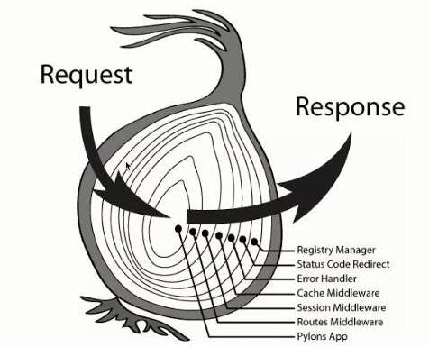

## 技术选型

### Node.js

Node.js是一个基于世界上最快的Javascript引擎——Chrome V8引擎的环境。使用Node.JS搭建的Web服务与传统的Web服务不同，在Java和PHP这类语言中，每个连接都会触发生成一个新线程，每个线程可能需要2MB的配套内存。在一个拥有8GB RAM的系统上，理论上最大的并发连接数量是4,000个用户。随着客户数量的增长，如果希望 应用程序支持更多用户，必须添加更多服务器。除此之外，还有一个潜在技术问题，即用户可能针对每个请求使用不同的服务器，因此，任何共享资源都必须在所有服务器之间共享。鉴于上述原因，整个Web应用程序架构（包括流量、处理器速度和内存速度）中的瓶颈是：服务器能够处理的并发连接的最大数量。Node.js解决这个问题的方法是：更改连接到服务器的方式。每个连接创建一个在Node.js引擎的进程中运行的事件，而不是为每个连接生成一个新的线程，并且不会直接阻塞 I/O 调用，Node.JS具有以下几个特点

- 事件驱动
> 所谓事件驱动，是指在持续事务管理过程中，进行决策的一种策略，即跟随当前时间点上出现的事件，调动可用资源，执行相关任务，使不断出现的问题得以解决，防止事务堆积。Node.js设计思想中以事件驱动为核心，事件驱动在于异步回调，他提供的大多数api都是基于事件的、异步的风格。而事件驱动的优势在于充分利用系统资源，执行代码无须阻塞等待某种操作完成，有限的资源用于其他任务。事件驱动机制是通过内部单线程高效率地维护事件循环队列来实现的，没有多线程的资源占用和上下文的切换。

- 非阻塞IO
> Node.js遇到I/O事件会创建一个线程去执行，然后主线程继续往下执行，因此，拿profile的动作触发一个I/O事件，马上就会执行拿timeline的动作，两个动作并行执行，假如各需要1S，那么总的时间也就是1S。它们的I/O操作执行完成后，发射一个事件，profile和timeline，事件代理接收后继续往下执行后面的逻辑，这就是Node.js非阻塞I/O的特点。Java、PHP也有办法实现并行请求（子线程），但Node.js通过回调函数（Callback）和异步机制会做得很自然。

- 单线程
> Node.js跟Nginx一样都是单线程为基础的，这里的单线程指主线程为单线程，所有的阻塞的全部放入一个线程池中，然后主线程通过队列的方式跟线程池来协作。我们写js部分不需要关心线程的问题，简单了解就可以了，主要由一堆callback回调构成的，然后主线程在循环过在适当场合调用。

针对优惠卷发放这个项目，这个项目主要是属于I/O密集型的应用。而Node.js作为一门脚本语言，开发效率高，适合I/O密集型的应用。同时应用RESTful服务中无状态的特点，可以轻易处理非常大量的连接，本身没有太多的CPU运算，只需要接收HTTP请求，并存取数据即可返回。利用单线程的特点，还可以在多核机器上组成应用集群并进行负载均衡，进一步提高并发效率。

### Koa框架

Koa和Express都是Node.JS的主流应用开发框架。Express是一个完整的Node.js应用框架。Koa是由Express团队开发的，但是它有不同的关注点。Koa致力于核心中间件功能。Node.js中间件是访问请求对象（req）和响应对象（res）的例程。这些例程在路由处理程序之前被调用，因此它们位于客户端与生成响应的路由逻辑的“中间”。Node.js应用程序可以将中间件例程“链接”到自定义请求/响应管道中。管道可以根据请求和响应进行操作，包括头和主体。Express和Koa都包含中间件，但实现方法却截然不同。核心Koa模块只是中间件内核。而Express包含一个完整的应用程序框架，具有路由和模板等功能。Koa确实有这些功能的选项，但它们是单独的模块。因此，Koa的模块化程度更高；您只需包含所需的模块即可。核心KOA模块只有大约2千行代码，因此，如果您只需要核心请求应答上下文对象，则Koa占用空间非常小。

因此，Koa的特点是优雅、简洁、表达力强、自由度高。它与Express相比，它是一个更轻量的Node.js框架，因为它所有功能都通过插件实现，这种插拔式的架构设计模式，是比较符合我们这一次优惠券发放的项目的。同时，Koa采用async/await特性避免了大量的回调，使代码看起来更加优雅简洁。选择Koa框架可以确保本次项目的快速启动以及性能的需求。

而针对中间件的架构组织，Koa使用的是洋葱圈模型，请求先是按图中顺序从外部开始向内经过每个中间件模块，然后再逆序依次做出响应。处于外层的中间件必须通过next函数调用内层中间件，当一个中间件调用next()后，会将控制权交给下一个中间件,直到下一个中间件不再执行next()后, 将会沿原路折返,将控制权依次递交给邻接的外层中间件。这样一来，我们可以将功能进行分层解耦，从外至内，依次可以是日志层、异常处理层、数据处理层、业务逻辑层、响应处理层。其中除了业务逻辑层，其他的层都是在不同的Web应用中被复用的，减少了大量的重复造轮子的工作，大幅提高了开发新应用的效率。

### JSON Web Token (JWT)

Web应用使用B/S架构，HTTP协议一直以来，都是被设计为是无状态的，简单来说，就是服务端在理解一条HTTP请求时，不需要通过上下文来判断，一个HTTP请求即一个完整的服务请求。JWT的基本流程是：客户端使用账号和密码请求登录接口。登录成功后服务器使用密钥生成JWT密文，然后将其返回给客户端。客户端在后续的请求中应携带上该JWT。服务器接收到JWT后验证签名的有效性，对客户端做出相应的响应。这样的话，我们就不需要在服务端存储JWT的信息，JWT是存储在客户端的，只要在加密时将用户id放入JWT载体中，服务器拿到JWT密文后，使用密钥解密后就可以拿到用户信息了，JWT是无状态的，由于加密的密钥存储在服务端，因此在传输过程中即使被第三方获取了JWT密文也无法从中获取任何用于信息，同时它不与任何服务端的机器绑定，只要签名密钥足够安全就能保证JWT的可靠性。所以针对项目的快速开发，减少了工程量，我们在本次项目中使用了JWT的认证机制。

### 缓存 & 消息队列(基于Redis)

Redis是基于内存的数据库，所以它相比基于磁盘的数据库具有更高的读写速率和更小的操作延迟，利用这些特点，可以将Redis作为数据库的缓存，同时Redis还提供了Pub/Sub模式，当Pub进程发送消息时，Sub进程可以立即收到消息并处理，根据该特性可以通过Redis搭建消息队列，将业务中高并发的持久化操作缓存起来，隔一段时间合并操作，减少请求数据库的次数。在业务中，所有的读操作都将优先访问Redis，若Redis无数据再通过持久化数据库获取数据并缓存到Redis。由于本次项目的高并发接口集中在获取优惠券接口，所以所有的写操作，若非访问获取优惠券接口，则立即持久化并更新缓存；否则仅更新缓存，然后将持久化的操作通过消息队列发布，由专门处理消息队列的node进程处理持久化操作。
